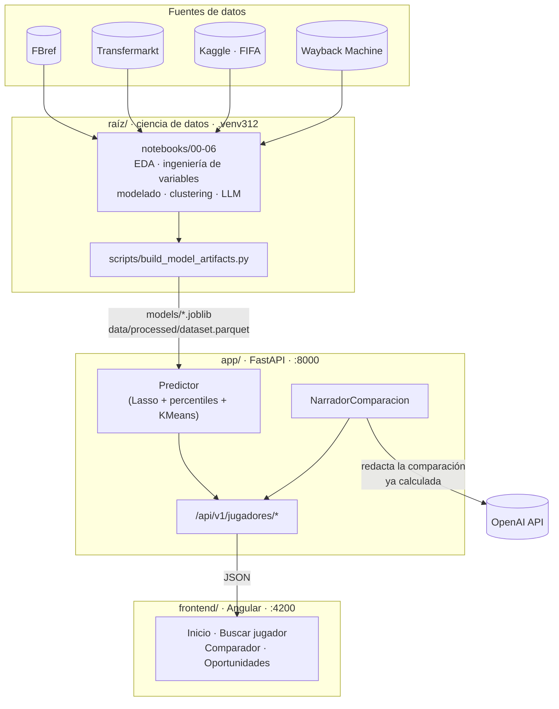
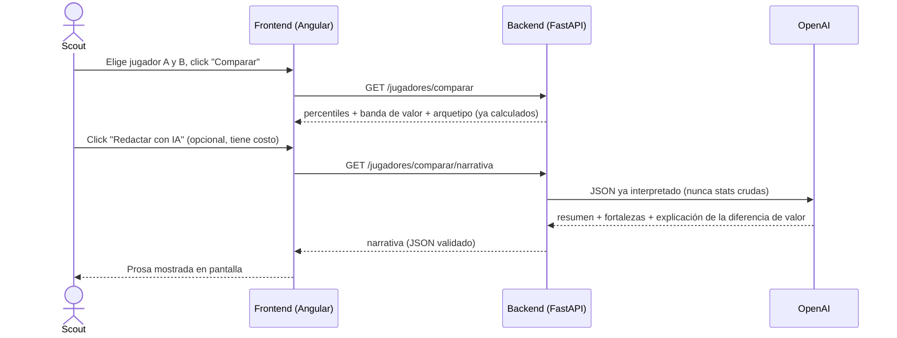

# ScoutIA

Proyecto educativo del Diplomado: un sistema de scouting que estima el **valor de mercado**
de futbolistas de las 5 grandes ligas europeas a partir de su rendimiento deportivo, con
percentiles frente a su posición, un clustering de arquetipos de estilo de juego, y una
comparación entre dos jugadores redactada en prosa por un LLM.

El valor de mercado siempre se muestra como **banda** (bajo/medio/alto), nunca como cifra
puntual, y la app nunca usa lenguaje de "comprar/vender" — es una herramienta de apoyo a la
decisión de un scout humano, no un tasador ni un asesor de fichajes.

## De dónde salen los datos (no es una API)

Los datos **no vienen de una API que se actualiza sola** — son el resultado de web scraping
propio, corrido una sola vez (septiembre de 2026) y congelado en este repo. Cada fila es una
fotografía de ese momento, no un valor en vivo:

- **FBref**: estadísticas de rendimiento por temporada, vía el paquete `soccerdata`
  (`scripts/descargar_fbref.py`).
- **Transfermarkt**: valor de mercado, posición, altura, edad — no tiene API pública, se
  scrapea directo el HTML de las plantillas de cada club/temporada
  (`scripts/descargar_transfermarkt.py`).
- **Kaggle** ("EA Sports FC 24 complete player dataset"): vencimiento de contrato para
  2021-2022 a 2023-2024.
- **Wayback Machine**: vencimiento de contrato para 2024-2025 y 2025-2026 (Kaggle todavía no
  cubre esas temporadas) — capturas archivadas de Transfermarkt, no el sitio en vivo.

Para tener una foto más reciente hay que volver a correr los scripts de descarga y
`scripts/build_model_artifacts.py` a mano — la app no vuelve a scrapear nada por su cuenta,
ni tiene ningún proceso programado que la mantenga al día.

## Arquitectura

El repo tiene tres partes independientes que se comunican entre sí, pero corren con
entornos y lenguajes separados (ver "Cómo correr cada parte" más abajo):



`scripts/build_model_artifacts.py` es la frontera entre los dos mundos: reentrena el modelo
sobre el 100% de los datos y congela todo lo que el backend necesita servir (modelo, encoder,
percentiles, clustering) en `models/` + `data/processed/dataset.parquet`. El backend nunca
entrena nada — solo carga esos artefactos una vez al arrancar.

### La comparación con LLM, paso a paso



El LLM nunca recibe estadísticas crudas ni calcula nada — solo redacta en prosa un JSON que
los modelos estadísticos ya resolvieron. Por eso es un endpoint aparte, disparado por un botón
explícito: la llamada a OpenAI tiene costo y puede tardar ~5-40s.

## Estructura del repo

```
data/            # raw / interim / processed (no se versiona, ver .gitignore)
models/          # artefactos congelados por build_model_artifacts.py (no se versiona)
notebooks/       # 00-06: unificación, EDA, ingeniería de variables, modelado, perfil, LLM
scripts/         # descarga de datos, build_model_artifacts.py, compartir/detener la app
src/             # utilidades compartidas por los notebooks (parseo, normalización)
app/             # backend FastAPI (proyecto uv independiente, src-layout)
frontend/        # frontend Angular 22 + Tailwind v4
AGENTS.md        # convenciones, decisiones de diseño y trampas encontradas (lectura técnica)
```

## Cómo correr cada parte

El repo mezcla tres entornos a propósito separados — no instalar dependencias de uno en
otro (detalle completo en `AGENTS.md`).

### 1. Notebooks (00 → 06, de punta a punta)

Requiere **Python 3.12** (Linux, macOS o Windows). Todo lo que leen los notebooks ya viene
versionado — datos crudos, intermedios, procesados y `models/` —, así que corren completos
en un clon nuevo **sin internet y sin `OPENAI_API_KEY`**:

```bash
python3.12 -m venv .venv312          # o: uv venv --python 3.12 --seed .venv312
.venv312/bin/pip install -r requirements.txt    # Windows: .venv312\Scripts\pip
cd notebooks
../.venv312/bin/jupyter nbconvert --to notebook --execute --inplace 0*.ipynb
```

(o abrirlos en Jupyter/VS Code con el kernel de `.venv312` y "Run All", en orden 00 → 06.
`04-modelado` es el más lento, ~5 min por la búsqueda de hiperparámetros.) Sin
`OPENAI_API_KEY` en `.env`, `05-llm` corre igual y solo se salta la llamada real a OpenAI.

### 1b. Regenerar el modelo servido (opcional — `models/` ya viene versionado)

```bash
.venv312/bin/python scripts/build_model_artifacts.py
```

Lee `data/processed/fbref_tm_features.parquet` + `fbref_tm_eda.parquet` y escribe
`models/*.joblib`, `models/metadata.json` y `data/processed/dataset.parquet` — lo que
consume el backend.

### 2. Backend (FastAPI)

```bash
cd app
uv sync
uv run uvicorn app.main:app --reload --port 8000
```

(`OPENAI_API_KEY` es opcional — ver sección "Configuración" más abajo.)

- Documentación interactiva: http://localhost:8000/docs
- Tests: `uv run pytest -q`
- Sin `OPENAI_API_KEY`, toda la app funciona igual excepto
  `GET /jugadores/comparar/narrativa`, que responde `503`.

### 3. Frontend (Angular)

```bash
export NVM_DIR="$HOME/.nvm"; . "$NVM_DIR/nvm.sh"   # node vía nvm, no está en el PATH por defecto
cd frontend
npm install
npm start
```

- Aplicación: http://localhost:4200 (con el backend en `:8000` corriendo — `proxy.conf.json`
  reenvía `/api/v1` para que la ruta relativa funcione en desarrollo).
- `npm run generate:api-types` regenera los tipos TypeScript desde `/openapi.json` — correr
  después de cualquier cambio de schema en el backend (requiere el backend corriendo).

### Correr todo en desarrollo

Dos terminales, una por servicio (backend primero):

1. Terminal 1: `cd app && uv run uvicorn app.main:app --reload --port 8000`
2. Terminal 2: `export NVM_DIR="$HOME/.nvm"; . "$NVM_DIR/nvm.sh"; cd frontend && npm start`

Con ambos corriendo, abrir http://localhost:4200.

## Compartir la app (sin desplegar nada permanente)

```bash
scripts/compartir_app.sh   # build de Angular + backend en :8000 (sirve ambos) + túnel público
scripts/detener_app.sh     # baja todo — a partir de acá no se gasta nada
```

Sirve el build de Angular y la API desde el mismo puerto (`:8000`) y abre un túnel público de
Cloudflare (URL nueva cada vez, válida mientras el proceso esté vivo) — pensado para que
alguien pruebe la app puntualmente desde otra red, no como despliegue permanente (Docker está
explícitamente prohibido por el spec en cualquier fase). La URL no tiene autenticación y el
LLM sigue consumiendo `OPENAI_API_KEY` real por cada llamada, así que conviene bajarla
(`detener_app.sh`) cuando no se está mostrando.

## Despliegue permanente en Vercel

`scripts/compartir_app.sh` sirve para pruebas puntuales, pero muere apenas cerrás la
terminal. `vercel.json` (raíz del repo) usa la feature [Services](https://vercel.com/docs/services)
de Vercel para desplegar frontend y backend como un solo proyecto, en un solo dominio,
disponible todo el tiempo:

```json
{
    "services": {
        "frontend": { "root": "frontend", "framework": "angular" },
        "backend": { "root": "app", "framework": "fastapi", "entrypoint": "app.main:app" }
    },
    "rewrites": [
        { "source": "/api(/.*)?", "destination": { "type": "service", "service": "backend" } },
        { "source": "/(.*)", "destination": { "type": "service", "service": "frontend" } }
    ]
}
```

### Antes del primer deploy (una sola vez, ya hecho en este commit)

El servicio de backend en Vercel solo empaqueta lo que vive **dentro** de `app/` — no ve
`models/` ni `data/processed/` de la raíz (siguen sin versionarse, se regeneran con
`scripts/build_model_artifacts.py`). Por eso hay copias versionadas en `app/models/` y
`app/data/processed/`, generadas por:

```bash
scripts/preparar_deploy_vercel.sh
```

Correr este script (y volver a hacer `git add app/models app/data` + commit) cada vez que se
regenere el modelo y se quiera redesplegar.

También se generó `app/requirements.txt` (`uv export --format requirements.txt --no-dev
--no-hashes`) porque el builder de Python de Vercel espera ese archivo, no `pyproject.toml` +
`uv.lock` directamente — `app/pyproject.toml` sigue siendo la fuente de verdad para
desarrollo local (`uv sync`); `requirements.txt` es solo para el deploy y hay que regenerarlo
si cambian las dependencias (`cd app && uv export --format requirements.txt --no-dev
--no-hashes -o requirements.txt`).

### En el dashboard de Vercel

1. **Importar el repo.** En la pantalla de configuración del proyecto, **Root Directory**
   debe quedar en `./` (ahí es donde Vercel busca `vercel.json` con la clave `services`) y
   **Build/Output/Install Settings** deben quedar apagados — en modo `services` esos ajustes
   se definen por servicio dentro de `vercel.json`, no a nivel de proyecto.
2. **Environment Variables** (se llenan en el dashboard, nunca en `vercel.json`):

   | Variable | Valor |
   |---|---|
   | `OPENAI_API_KEY` | tu clave real |
   | `PYTHONPATH` | `src` (el backend usa layout `src/`; sin esto, Vercel puede no encontrar `app.main:app`) |
   | `MODELS_DIR` | `models` |
   | `DATASET_PATH` | `data/processed/dataset.parquet` |
   | `IMAGENES_PATH` | `data/processed/imagenes_jugadores.json` |

   Las últimas tres pisan los defaults de `Settings` (pensados para correr desde la raíz del
   repo en local) por rutas relativas al *root* del servicio de backend (`app/`), donde ahora
   sí existen esas copias.
3. **Deploy.** Como frontend y backend quedan bajo el mismo dominio, `API_BASE_URL` (ya
   relativo, `/api/v1`) funciona sin configuración extra — mismo mecanismo que
   `scripts/compartir_app.sh`.

### Limitación conocida: LLM y timeouts de función serverless

`GET /jugadores/comparar/narrativa` puede tardar ~5-40s (ver AGENTS.md). Las funciones
serverless de Vercel tienen un límite de duración que en el plan gratuito puede quedar corto
para el caso más lento. Si ese endpoint empieza a fallar por timeout en producción, subir el
`maxDuration` de la función en la configuración del servicio backend (o en el plan de Vercel)
es el siguiente paso — no es algo que resuelva la app en sí.

## Configuración (`.env`)

En una copia nueva del repo, copiar `.env.example` a `.env` en la raíz (nunca se versiona):

```bash
cp .env.example .env
```

| Variable | Requerida | Descripción |
|---|---|---|
| `OPENAI_API_KEY` | No | Sin ella, todo funciona salvo la narrativa con LLM del comparador (503). |
| `LLM_MODELO` | No | Modelo de OpenAI a usar. Default: `gpt-4.1`. |

## Reglas de producto (no negociables, ver `AGENTS.md`)

- El valor de mercado siempre se presenta como banda (`valor_bajo`/`valor_medio`/`valor_alto`),
  nunca como cifra puntual.
- Nunca lenguaje de "comprar/vender" — los jugadores infravalorados por el modelo (vista
  *Oportunidades*) se presentan como "casos a revisión manual".
- El LLM nunca calcula un número — solo redacta el JSON que ya calcularon los modelos
  estadísticos.
- Sin autenticación, sin base de datos, sin Docker, en ninguna fase (spec del diplomado).

## Documentación técnica extendida

`AGENTS.md` es el registro vivo de decisiones de diseño, trampas de datos encontradas (y
cómo se resolvieron), qué se descartó y por qué, y el detalle exacto de cada modelo
(hiperparámetros, métricas, justificación de por qué el modelo servido es Lasso y no
XGBoost pese a tener peor métrica). Es la referencia para entender el *por qué* detrás de
cualquier decisión de este README.
